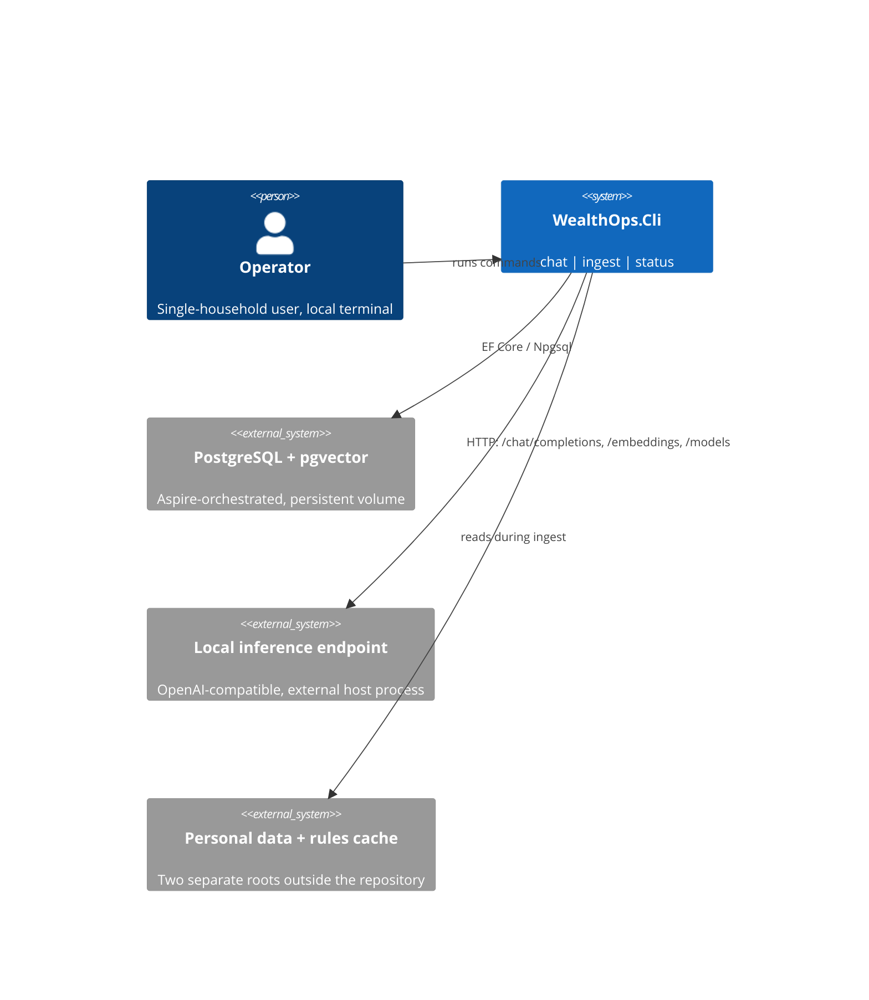
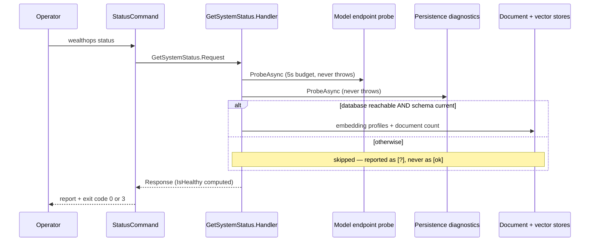

# CLI_AGENTS.md

## TL;DR

The v1 operator surface — `chat`, `ingest`, `status` — and a **second composition root** that dispatches Mediator in-process rather than calling Host over HTTP.

## Non-Negotiables

- **Never hard-code an operator particular.** No municipality, provider, account identifier, path, or **model identifier** may appear in this project's code or in its committed `appsettings.json`. `appsettings.Example.json` carries placeholders only; real values live in the gitignored `appsettings.Local.json` or `WEALTHOPS_*` environment variables. A model id in code breaks AC-12 as surely as a municipality breaks BR-16.
- **Never print personal content to a log.** Command *output* is for the operator and may show paths and counts; the `ILogger` stream may not. Log identifiers, counts, and durations (NFR-8).
- **`status` must never throw for a broken environment.** It is the instrument an operator reaches for when the stack is down. Every collaborator it uses reports failure as data.
- **Never render an unmeasured value as `[ok]`.** When a probe did not run, print `[?]`. False reassurance in a diagnostic is worse than silence — see Key Behaviors.
- **Keep `AddApplication()` + `AddInfrastructure()` as the only composition.** Registering a service directly here would let the CLI and Host drift apart.

## System Context

The CLI composes all four layers in one process. Its two external dependencies — the database and the model endpoint — have very different lifecycles: the database is orchestrated by the Aspire AppHost, while local inference is an **external host process** that may simply not be running.

`status` is the only place where configuration, the endpoint, and the database are reconciled against each other:

## Architecture Decisions

**LADR-001: In-process composition root, not an HTTP client of Host** — promoted to `.docs/adr/ADR-001-cli-in-process-composition-root.md`. Root `AGENTS.md` previously described a `WealthOps.ChatHost` owning the Anthropic SDK and talking to Host over HTTP; that project never existed and v1 is local-only with no Anthropic dependency. Corrected in root `AGENTS.md` as part of WT-001.

**LADR-002: Local inference is an external process, never an Aspire resource**
- *Date:* 2026-09-20 · *Status:* Accepted
- *Context:* Inference is installed on the machine, may be GPU-bound, and has a lifecycle the stack does not control. Aspire orchestrates containers.
- *Decision:* The AppHost passes only `WealthOps:Models:Endpoint` to both projects. Nothing starts, stops, or waits for the model.
- *Rejected:* Modelling it as an Aspire container resource — would make `dotnet run --project src/WealthOps.AppHost` fail or hang on a machine where inference is installed natively, which is the normal case.
- *Consequences:* The stack starts fine with no model running; `status` reports the endpoint unreachable rather than refusing to boot. This is also what lets the whole test suite pass with no model (NFR-3, AC-9).

**LADR-003: Migrations run on `chat` and `ingest`, never on `status`**
- *Date:* 2026-09-20 · *Status:* Accepted
- *Context:* Something must apply the schema. Migrating on every command would make `status` mutate the thing it is measuring.
- *Decision:* `chat` and `ingest` call `MigrateWealthOpsAsync` before dispatching; `status` does not and instead reports pending migrations.
- *Consequences:* `status` is safe to run against any database state and is a genuine read-only probe. An operator whose schema is stale is told so, with the command that would fix it.

## Key Behaviors

- **`[ok]` / `[!]` / `[?]` are three distinct states.** `[!]` is measured-and-bad; `[?]` is not-measured. When the database is unreachable, pgvector, schema, document count and stored embeddings are all `[?]` — an earlier version printed `schema current` beside a failed connection, which read as reassurance precisely when the stack was broken.
- **Exit codes are distinguished, not collapsed into "nonzero":** `0` success, `1` failure, `2` usage error, `3` `status` ran successfully and found something wrong. A script gating on `status` needs to tell "the stack is unhealthy" apart from "you typed the command wrong".
- **`ingest` in M0 records only** — walks, hashes, routes by folder position, and records idempotently. No text extraction, chunking, or embedding until M1. The output says so explicitly rather than implying the corpus is queryable.
- **`ingest` refuses a path outside both configured roots.** Every ingested file must belong to exactly one corpus; a path under neither root has no corpus to be assigned, and there is no safe default.
- **A gateway failure ends the chat *turn*, not the session.** The likeliest cause is the inference process stopping; losing an entire conversation to that would be a poor trade. The conversation stays intact.
- **Only switch-shaped arguments reach the configuration provider.** `AddCommandLine` throws on positional arguments, so `wealthops ingest <path>` would crash at startup if the verb and its operand were passed through.
- **Logging is `Warning` by default here**, unlike the rest of the stack. Routine Information-level operation logs would bury the command's own output in an interactive tool.
- **Configuration precedence, lowest to highest:** defaulted personal-data directory → `appsettings.json` → `appsettings.Local.json` → environment variables → command-line switches. `appsettings.Example.json` is deliberately *not* loaded, so an unconfigured machine fails validation loudly instead of running against fictional settings.

## Test References

No CLI-specific test project yet — command rendering and argument dispatch are verified by hand. `InternalsVisibleTo("WealthOps.Cli.UnitTest")` is already declared; add that project (L0) when the command surface grows beyond three verbs.

The behaviour behind the commands is covered elsewhere: `WealthOps.Application.UnitTest` (options binding and validation, routing, chat handler), `WealthOps.Application.ComponentTest/Features/Ingestion` (the real file walk), `WealthOps.Infrastructure.ComponentTest/Persistence` (stores against real pgvector).

## Quality Constraints

- **No automated test may require a running language model** (NFR-3). Anything added here that needs `IChatModel` or `IEmbeddingModel` must be tested against a stub.
- **`status` must stay usable on a broken machine.** Any new probe added to it reports failure as data and carries its own short timeout — the gateway's configured timeout is minutes long by design, and `status` must not inherit it.

## Migration Plans

- **M1** adds real ingestion: text extraction, chunking, embedding, and corpus-scoped retrieval behind `chat`. `IngestPath` gains those stages; its `Response` counts stay meaningful. `CorpusQuery` already carries `QueryText` so a lexical leg or a reranker can be added without changing an Application contract.
- **M3** adds tool-backed calculation. `ChatToolDefinition` and `ChatToolCall` already exist on `IChatModel` and are unused — `SendChatMessage` sends no tools in M0 deliberately, because offering a tool the system cannot service invites a fabricated call.

## Changelog

| Date | Change | Ref |
|:-----|:-------|:----|
| 2026-09-20 | Created with the project — `chat` / `ingest` / `status`, configuration sources incl. `WEALTHOPS_PERSONAL_DATA_DIR`, `appsettings.Example.json`. LADR-001 (in-process root, promoted to ADR-001), LADR-002 (inference external), LADR-003 (migrate on chat/ingest only). | WT-001 |
| 2026-09-20 | `status`: unmeasured values render `[?]`, never `[ok]` — an unreachable database previously reported "schema current" and a document count of 0. | WT-001 |
