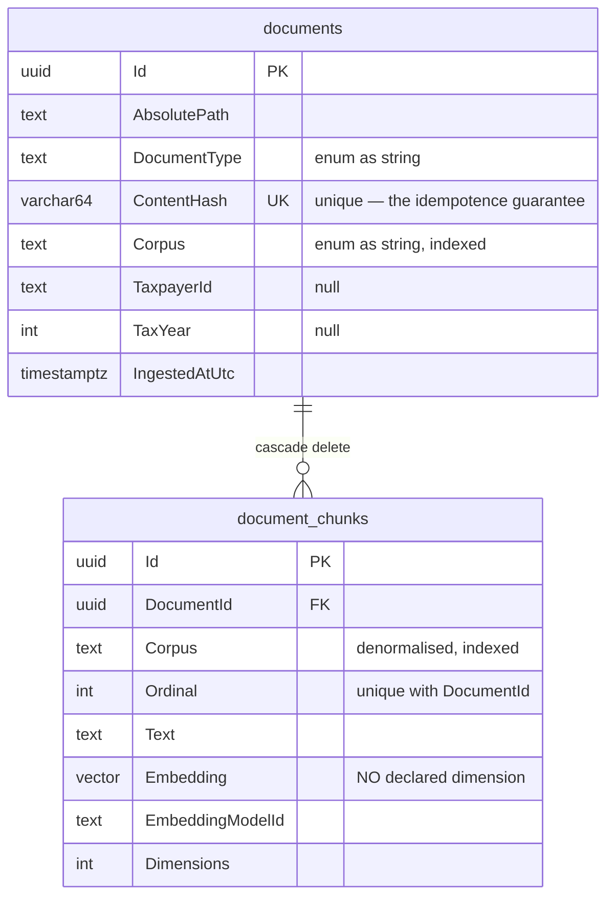

# INFRASTRUCTURE_AGENTS.md

## TL;DR

Implements the contracts defined in Application — EF Core + PostgreSQL/pgvector persistence (`Persistence/`) and the OpenAI-compatible model gateway (`Clients/OpenAiCompatible/`).

## Non-Negotiables

- **Implements Application interfaces; never the reverse.** Concrete stores/clients here implement `IFoo` from Application. Application must not reference an Infrastructure concrete type.
- **References Application and Domain only** — never Host.
- **EF Core migrations are generated code.** Keep them under `Persistence/Migrations/`; they are marked generated via the root `.editorconfig` glob and generated migration classes must carry `[ExcludeFromCodeCoverage]`. Register the `DbContext` with a scoped lifetime.
- **No business rules.** Infrastructure adapts to the outside world (DB, HTTP, cache); domain decisions stay in Domain, orchestration in Application.
- **No vendor name in a type name.** The gateway types are named for the protocol endpoint they speak to — `ChatCompletionsClient`, `EmbeddingsClient`, `ModelEndpointProbe` — so any server implementing the shape is addressable by configuration alone (EP-3). The folder name `OpenAiCompatible` describes the *protocol*, not a provider.
- **Never resolve configuration eagerly at registration.** `AddInfrastructure` must read connection strings from the container, not capture them when it runs — see Key Behaviors.
- **The embedding column is `vector` with no declared width.** Never "fix" it to `vector(n)`; that would make changing the embedding model a migration and break AC-12 (ADR-002).

## System Context

`Corpus` is duplicated onto the chunk deliberately: corpus-scoped search is the mechanism that keeps personal content out of a rules answer, and a filter depending on a join is a filter that can be forgotten.

## Architecture Decisions

**LADR-001: The model gateway does not follow the Refit list/singular client convention**
- *Date:* 2026-09-20 · *Status:* Accepted
- *Context:* `external-api-clients.instructions.md` prescribes a cached-singular / uncached-list split with a `HybridCache` adapter. That rule governs resource APIs.
- *Decision:* Typed `HttpClient` + `System.Text.Json` against `POST /chat/completions`, `POST /embeddings`, `GET /models`. No Refit, no caching adapter.
- *Rejected:* Applying the convention anyway. Inference has no cacheable resource identity — there is no id to key on — and caching a completion would obscure which figures came from where, working against NFR-4.
- *Consequences:* The rule's scope is now explicit so a future agent does not "fix" this to match it. If a genuine resource client is ever added here, the rule applies to that.

**LADR-002: A shared `NpgsqlDataSource` singleton, not a connection string per context**
- *Date:* 2026-09-20 · *Status:* Accepted
- *Context:* Registering the pgvector type handler (`UseVector()`) is a data-source-level concern.
- *Decision:* One `NpgsqlDataSource` singleton with the handler registered, injected into `AddDbContext`.
- *Consequences:* Without it `Vector` does not round-trip at all. Any new context or raw Npgsql use must go through this data source.

**ADR-002 (repo-level): dimension-less embedding column** — see `.docs/adr/ADR-002-dimensionless-embedding-column.md`. Consequence for this layer: **no ANN index in v1**, because pgvector needs a fixed dimension to build `ivfflat`/`hnsw`. Sequential scan with cosine distance is correct at NFR-6 volume and has no recall loss.

## Key Behaviors

- **Configuration is resolved from the container, never captured at registration.** `AddWealthOpsPersistence` reads the connection string inside the `NpgsqlDataSource` factory. Reading it eagerly binds whatever configuration existed when `AddInfrastructure` was called — under `WebApplicationFactory` that is *before* the test host applies its overrides, and in general it silently ignores any late-arriving source. This was a real defect found by the Host integration test.
- **Dimension mismatch is checked before anything is written.** `VectorStore.UpsertChunksAsync` validates the whole batch first, so a bad batch fails whole rather than half. A vector of the wrong width still stores, still searches, and still returns confident-looking neighbours — the damage is silent and unrecoverable (ADR-002, NFR-7).
- **`EmbeddingsClient` orders vectors by the endpoint's reported `index`.** The protocol does not promise response order; pairing by arrival would silently attach each vector to the wrong text.
- **The gateway base address gets a trailing slash.** Without it, a relative request URI replaces the last path segment, so an endpoint configured as `.../v1` silently loses the `/v1`.
- **`ModelEndpointProbe` carries its own 5-second budget** and never throws. The configured completion timeout is minutes long by design (local CPU inference is slow), and `status` must not hang for minutes to report that nothing is listening.
- **`PersistenceDiagnostics` reports pgvector separately from connectivity.** A database that connects but lacks the extension is the single most likely misconfiguration in this stack and looks healthy right up until the first migration or search.
- **Both diagnostics types report failure as data, never by throwing.** They exist to be called on a broken machine.
- **`DocumentStore.RecordAsync` has three outcomes, not two.** Content already known at a *different* path is neither new nor unchanged — the file moved. Recording it would duplicate; ignoring it would leave a stale path.
- **`WealthOpsDbContextFactory` is design-time only.** Its connection string is a placeholder with no credential worth having; `dotnet ef migrations add` needs a provider to generate SQL, not a live server. Override with `WEALTHOPS_DESIGNTIME_CONNECTION`.
- **Migrations run on startup** (`MigrateWealthOpsAsync`) — appropriate here in a way it would not be for a multi-instance service, because this is a single-operator system (OOS-16) and the migrating process is the only user of the database.

## Test References

- L0 — `tests/WealthOps.Infrastructure.UnitTest/Clients/OpenAiCompatible/`: gateway clients against `StubHttpMessageHandler` (success, non-success, unreachable, malformed payload, wrong vector count, width mismatch), options validator.
- L1 — `tests/WealthOps.Infrastructure.ComponentTest/Persistence/`: `VectorStoreTests` (vector round-trip, **corpus isolation**, cosine ordering, upsert replacement, batch-atomic mismatch rejection, embedding profiles), `DocumentStoreTests` (idempotence, relocation, optional metadata round-trip), `PersistenceDiagnosticsTests`. `PersistenceTestContext` applies the real migration to each isolated database, so the migration itself is under test.

## Quality Constraints

**No automated test may require a running language model** (NFR-3). Gateway clients are exercised through a stubbed `HttpMessageHandler`.

**The L1 tests need a pgvector-enabled PostgreSQL.** `tests/WealthOps.TestFramework.Aspire` runs `pgvector/pgvector:pg17`. A developer with a container pre-warmed before that change gets an explicit "recreate `project-test-postgres`" message rather than a raw PostgreSQL error.

## Packages

`Microsoft.EntityFrameworkCore(.Relational/.Design)`, `Npgsql.EntityFrameworkCore.PostgreSQL`, `Pgvector`, `Pgvector.EntityFrameworkCore`, `FluentValidation.DependencyInjectionExtensions`, `Microsoft.Extensions.Http.Resilience` — declared centrally in `Directory.Packages.props`.

## Changelog

| Date | Change | Ref |
|:-----|:-------|:----|
| 2026-05-30 | Created — empty persistence + clients skeleton. | — |
| 2026-09-20 | Added `Clients/OpenAiCompatible/` (chat, embeddings, endpoint probe, options + validator, wire contracts) and `Persistence/` (`WealthOpsDbContext`, two configurations, `DocumentStore`, `VectorStore`, `PersistenceDiagnostics`, design-time factory, `MigrateWealthOpsAsync`, `InitialSchema` migration). `Extensions/AddInfrastructure`. LADR-001 (gateway exempt from the Refit convention), LADR-002 (shared `NpgsqlDataSource`). | WT-001 |
| 2026-09-20 | Connection-string resolution moved from registration time into the `NpgsqlDataSource` factory — the eager read ignored configuration sources added after composition and broke the Host integration test. | WT-001 |
